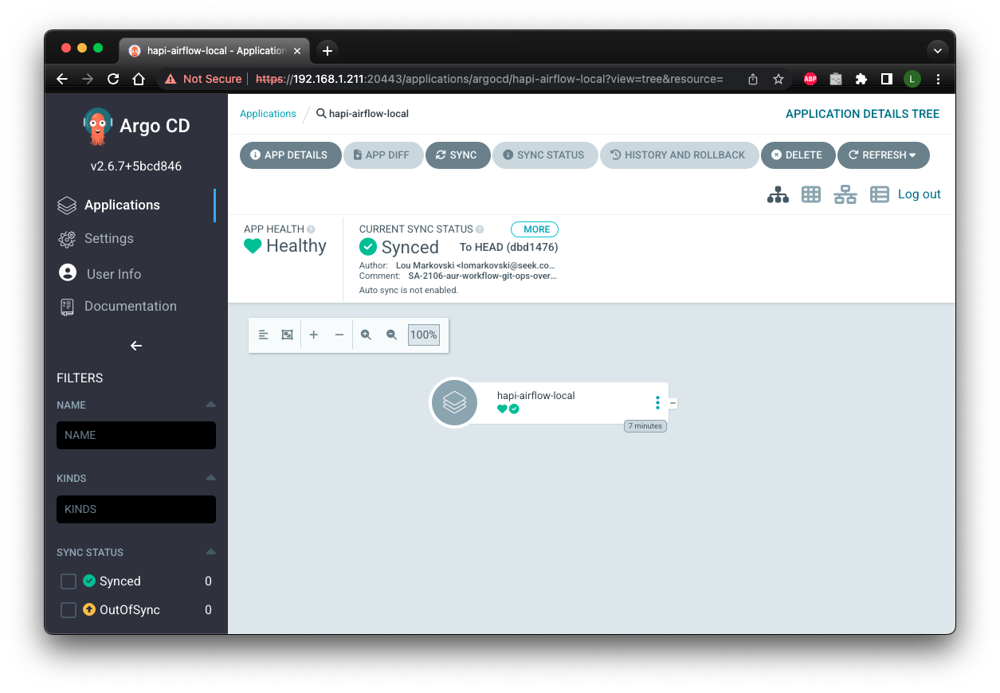

# Declarative GitOps with Argo CD

Apache Airflow instances are deployed to [Amazon Elastic Kubernetes Service (EKS)](https://aws.amazon.com/eks/)
with [Argo CD](https://argo-cd.readthedocs.io/en/stable/) declarative GitOps.

Argo CD follows the GitOps pattern of using Git repositories as the source of truth for defining the
desired application state. Kubernetes manifests a `kustomize` application.

## Definitions

- [Argo CD](https://argo-cd.readthedocs.io/en/stable/) provides the declarative GitOps for continuous
delivery with Kubernetes.
- [Kustomize](https://github.com/kubernetes-sigs/kustomize) is a standalone tool to customize Kubernetes
objects through a [kustomization](https://kubectl.docs.kubernetes.io/references/kustomize/glossary/#kustomization) file.

## Kustomize Overview
`kubectl` supports the management of Kubernetes objects with the subcommand:

``` sh
kubectl kustomize
```

Kustomize has the concepts of **_bases_** and **_overlays_**:

- **_base_** is a directory with a kustomization.yaml which contains a set of
  resources and associated customisation.
- **_overlay_** is a directory with a `kustomization.yaml` that refers to other
  kustomization directories as its bases.

A **_base_** has no knowledge of an **_overlay_** and can be used in multiple overlays.
An **_overlay_** may have multiple bases and it composes all resources from those bases.
The **_overlay_** may extend the behaviour of the **_base_** by adding customisations.

## `kubectl` integration

Aim to use the `kustomize` tool version that aligns with the kustomize version embedded
in the version of `kubectl`:

``` sh
kubectl version --short --client
```

``` sh title="Embedded kustomize version in kubectl sample output."
Client Version: v1.26.3
Kustomize Version: v4.5.7
```

!!! note
    The `kustomize` version is defined by the `KUSTOMIZE_VERSION` environment variable within the
    project `Makefile`.

## Adding new Airflow projects

### Choose a short name for your new project
The project short name provides the boundaries between Apache Airflow instances at the
problem domain, or project level. For example, `hapi`.

The project short name will be used to build the Makefile targets and provide context to
the Kubernetes deployment. Each project short name can have multiple environments associated with it
based on the list:

- local
- dev
- prd

### Creating the blank `kustomization.yaml` file
A blank `kustomization.yaml` file allows us to standup a minimal application in Kubernetes.

This is how that presents in Argo CD:


Use `resources/scripts/project-primer.sh` with the `-r` switch with project short name and
deploy environment as parameters.

``` sh title=""
resources/scripts/project-primer.sh -p <project_short_name> -e <deploy_environment> -r
```

For example:
``` sh title="New kustomization.yaml project primer example."
resources/scripts/project-primer.sh -p hapi -e local -r
```

### Priming the Airflow kustomize project
The project primer script uses Python’s Jinja2 template engine to generate Kubernetes manifests
dynamically based on the Argo CD overlay context. The template engine driver is the `mapping.json` file
that defines the parameters that control the behavior of the Jinja2 template engine. This allows for
finer grained generation of the Kubernetes manifests per project environment.
