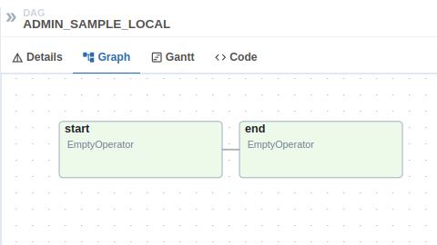

# DAG starter template

Airflow DAGs are written in Python and are technically just a Python module (with `.py` extension). DAGs are interpreted by Airflow via the [DagBag facility](https://airflow.apache.org/docs/stable/_modules/airflow/models/dagbag.html#DagBag) and can then be scheduled to execute.

DAGs files are placed under the `AIRFLOW__CORE__DAGS_FOLDER`. The directory location can be identified as follows:
``` sh
make print-AIRFLOW__CORE__DAGS_FOLDER
```

The default DAG template can help you get started creating your new DAG. The template DAG at `src/dagster/dags/template.py` features a set of `start` and `end` "book-end" tasks that can be used to delimit your job. You then add your own business related tasks in between.

The `start` and `end` tasks are instantiated via Airflow's [EmptyOperators](https://airflow.apache.org/docs/apache-airflow/stable/_api/airflow/operators/empty/index.html#module-airflow.operators.empty){target="blank"} and act as _safe_ landing zones for your job.

!!! note
    More information around Airflow DAG creation and concepts is available at the [Airflow tutorial](https://airflow.apache.org/docs/stable/tutorial.html){target="blank"}.

The actual source code of the `src/dagster/dags/template.py` is as follows:
``` python title="src/dagster/dags/template.py"
--8<-- "src/dagster/dags/template.py"
```

Copy `src/dagster/dags/template.py` into a new Python file. The filename should be descriptive enough to define your new workflow. In the following example, the Python module target will be called `sample`:
``` sh
cp src/dagster/dags/template.py src/dagster/dags/sample.py
```

A more detailed description about your new DAG can be provided by editing `src/dagster/dags/sample.py` and replacing the `description` variable value to suit. `description` renders in the Airflow UI and helps visitors understand the intent behind your workflow.

A quick validation of your new DAG can be performed with:

/// tab | Makester
``` sh
make local-list-dags
```
///

/// tab | Airflow CLI
``` sh
venv/bin/airflow dags list
```
///

``` sh title="Valid DAGs under the current runtime context."
dag_id                | filepath     | owner   | paused
======================+==============+=========+=======
ADMIN_BOOTSTRAP_LOCAL | bootstrap.py | airflow | False
ADMIN_SAMPLE_LOCAL    | sample.py    | airflow | True
```

The new sample DAG is rendered under the Apache Airflow dashboard's graph view as follows:

