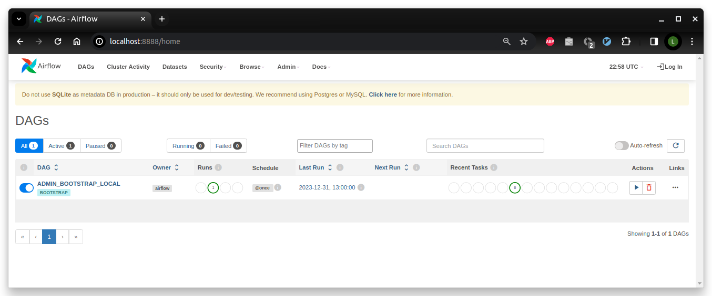

# Airflow instance runtime

Launch the Airflow webserver UI in [SequentialExector](https://airflow.apache.org/docs/apache-airflow/stable/executor/sequential.html) mode to visualise and interact with dashboard (`Ctrl-C` to stop):

``` sh
make local-airflow-start
```
You can access your local Airflow webserver console via [http://localhost:8888](http://localhost:8888).

The new sample DAG is rendered under the Apache Airflow dashboard's graph view as follows:


Dagster pre-defines a set of [Apache Airflow configuration](https://airflow.apache.org/docs/apache-airflow/stable/configurations-ref.html){target="blank"} items for a customised view. These are defined in the `resources/files/environment/local` file and can be edited to suit your preferences:

``` sh title="Apache Airflow customised configuration settings."
--8<-- "resources/files/environment/local"
```
